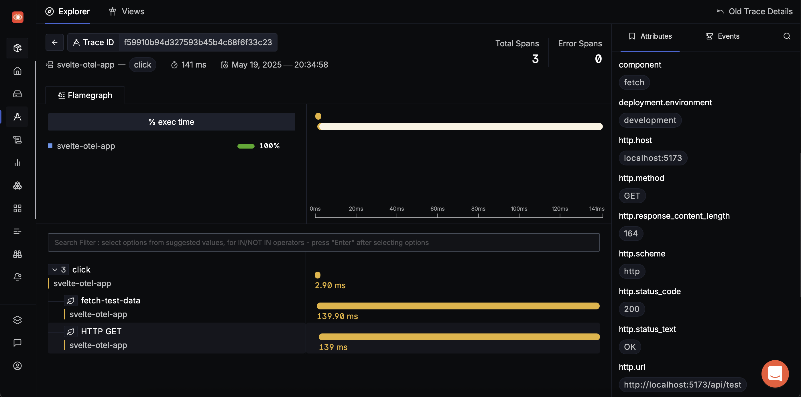

# Instrumenting Your Svelte App with OpenTelemetry Collector and SigNoz

This step-by-step implementation guide walks you through different concepts while helping you add "observability" to your Svelte web application. If you're new to terms like OpenTelemetry, SigNoz, or even what observability means, that is alright - this tutorial is designed for an audience of different knowledge levels.

## Prerequisites

This tutorial expects you to have basic understanding of Svelte or SvelteKit and JavaScript.

## What is Observability?

Imagine your Svelte application is a complex machine, like a modern car:
* Your car might have a few warning lights – "Check Engine," "Low Fuel." These tell you *if* a known problem occurs.
* Now, imagine your car has an incredibly detailed dashboard with sensors for *everything*: engine speed, individual tire pressures, the exact path it's taking (GPS), how quickly it responds when you press the accelerator, and even the temperature inside and out. With all this rich data, you (or a skilled mechanic) can understand not just *that* something is wrong, but *precisely why* it's wrong, even if it's a completely new or unexpected issue. You can ask new questions about the car's performance and get clear answers.

That's essentially what observability brings to your Svelte or any application. It's about understanding and 'tracing' the state and behavior of your app by examining the data it produces, requests it processes and more. This is incredibly helpful for:
* Finding and fixing bugs much faster
* Understanding why some parts of your app might be slow for users
* Improving the overall user experience
* Making confident changes and adding new features

### Types of Telemetry Data

We collect different types of data, often called **telemetry data**:

1. **Traces:** These are like a detective following a single user's action through your app. For example, when a user clicks a button to load a new page, a trace shows every step of that journey – the click itself, any data fetching from a server, and the time it took to display the new page. **Traces are our main focus in this tutorial.**

2. **Metrics:** These are numbers measured over time. Think of them as your app's vital signs: how many users are on a page, the average time a page takes to load, or the number of errors happening per minute.

3. **Logs:** These are like a detailed diary or journal kept by your app. They are text records of specific events, messages, or errors that happen, like "User [username] logged in successfully at [time]" or "Error: Failed to load image [image_name]."

## Tools We'll Use

### OpenTelemetry (OTel)
Think of OpenTelemetry as a universal toolkit or a set of standard "sensors" and "wiring instructions" for your application. It provides a vendor-neutral, open-source way for your app to generate and send out its telemetry data (traces, metrics, logs). Because it's a standard, you're not locked into one specific company's tools. You can use OpenTelemetry to instrument your app once, and then choose where you want to send that valuable data (Spoiler: we will be sending this treasure of data to SigNoz).

### SigNoz
SigNoz is an open-source observability platform. It's the "mission control center" or the "advanced diagnostic workshop" that receives, stores, and helps you make sense of all the telemetry data sent by OpenTelemetry from your app. SigNoz provides you with:
* Dashboards to visualize your data
* Tools to search and analyze traces
* Ability to set up alerts for when things go wrong
* And more

### OpenTelemetry Collector (Otel Collector)
This is a separate, highly configurable helper application. Imagine it as a smart, local "data processing and forwarding station" that sits between your app and SigNoz (or any other observability vendor).

#### Why use a Collector?
It is a best practice to begin with, and here are few other reasons:
1. **Receives Data:** It can collect telemetry data from your app (and potentially many other apps or services)
2. **Processes Data:** The Collector can modify or clean up your data before sending it on. For example, it can:
   * Add useful information
   * Remove sensitive data
   * Filter out unimportant "noisy" traces
3. **Exports Data:** It can then reliably send the processed data to one or more destinations, like your SigNoz account
4. **Flexibility:** If you ever want to send your data to a different observability tool, you often only need to change the Collector's configuration, not your application's code

## Objectives

In this tutorial, we will:
1. Take a Svelte application
2. "Instrument" this Svelte app using OpenTelemetry's JavaScript libraries
3. Create a special "healthcheck page" (e.g., `/health`)
4. Download, set up, and run an OpenTelemetry Collector locally
5. Configure the Collector to receive all trace data from our Svelte app
6. Configure the Collector to filter out traces from our `/health` page
7. Send the remaining traces to SigNoz Cloud

## 1: Prerequisites and Setup

### 1.1 Node.js and npm (Node Package Manager)

SvelteKit and all the OpenTelemetry JavaScript libraries require Node.js and its package manager, npm.

#### How to Check if You Already Have Them:
1. Open your computer's **Terminal**
   * **macOS:** Find Terminal in `Applications > Utilities` or search using Spotlight (`Cmd + Space`, then type "Terminal")
   * **Windows:** Use "Command Prompt", "PowerShell", or "Windows Terminal"
   * **Linux:** Usually `Ctrl + Alt + T` opens a terminal

2. Check Node.js version:
        ```bash
        node -v
        ```
   If installed, you'll see a version number like `v18.17.0` or `v20.5.0`

3. Check npm version:
        ```bash
        npm -v
        ```
   If installed, you'll see a version number like `9.6.7` or `10.1.0`

#### How to Install Node.js and npm:
1. Visit [https://nodejs.org/](https://nodejs.org/)
2. Download the **LTS (Long Term Support)** version for your OS
3. Run the installer and follow the on-screen instructions
4. **Important:** Close and reopen your terminal after installation
5. Verify installation by running `node -v` and `npm -v` again

### 1.2 SigNoz Cloud Account & Ingestion Details

SigNoz is where your app's performance data will be sent, stored, and visualized.

#### Signing Up for SigNoz Cloud:
1. Navigate to SigNoz sign-up page
2. Fill in required details (name, email, password)
3. Find these crucial pieces of information:
   * **OTLP HTTP Endpoint URL for Traces:** Format like `https://ingest.<region>.signoz.cloud:443/v1/traces`
   * **SigNoz Access Token:** A secret key for authenticating data submissions

Store these values securely in a text file:
        ```text
        SigNoz OTLP Endpoint URL: <paste the URL here>
        SigNoz Access Token: <paste the token here>
        ```

If you have any difficulties finding these values or need more details, refer to:
- [SigNoz Cloud Overview](https://signoz.io/docs/ingestion/signoz-cloud/overview/#endpoint)
- [SigNoz Cloud Keys](https://signoz.io/docs/ingestion/signoz-cloud/keys/)

## 2: Setting Up Your SvelteKit Project

### 2.1 Create Your SvelteKit Project

1. Open your terminal and navigate to your projects directory:
   ```bash
   # macOS/Linux
   cd ~/Documents/Projects
   
   # Windows
   cd C:\Users\YourUserName\Documents\Projects
   ```

2. Create a new SvelteKit project:
        ```bash
        npm create svelte@latest demo-otel-app
        ```

3. Follow the setup prompts:
   * Choose "SvelteKit demo app"
   * Select "No" for TypeScript (or "Yes" if you're comfortable with it)
   * Enable ESLint and Prettier
   * Disable Playwright and Vitest

4. Navigate to your project and install dependencies:
        ```bash
        cd demo-otel-app
        npm install
        ```

5. Start the development server:
        ```bash
        npm run dev
        ```

6. Visit `http://localhost:5173/` in your browser to verify the setup

### 2.2 Add a Healthcheck Page

1. Create a new directory and file:
   ```
   src/routes/health/+page.svelte
   ```

2. Add the following code to `+page.svelte`:
   ```svelte
        <script>
          import { onMount } from 'svelte';

          onMount(() => {
            console.log('The /health page has loaded in the browser. (OpenTelemetry should trace this page load if active).');
          });
        </script>

        <div>
          <h1>Application Health Status</h1>
          <p>Status: OK - Everything is running smoothly!</p>
          <p>
            This page is typically used by automated monitoring systems (like load balancers or uptime checkers)
            to verify that the application is responsive and healthy.
          </p>
          <p>
            For our OpenTelemetry setup, we will configure the OpenTelemetry Collector to specifically
            <strong>filter out (ignore)</strong> any performance traces generated from visits to this `/health` page.
            This helps keep our main performance data clean and focused on real user interactions.
          </p>
        </div>

        <style>
          div {
            padding: 25px;
       font-family: 'Segoe UI', Tahoma, Geneva, Verdana, sans-serif;
       text-align: center;
       max-width: 650px;
       margin: 50px auto;
       border: 1px solid #d3d3d3;
       border-radius: 8px;
       background-color: #f9f9f9;
       box-shadow: 0 2px 4px rgba(0,0,0,0.1);
     }
     h1 {
       color: #2c3e50;
            margin-bottom: 20px;
          }
          p {
       color: #34495e;
            font-size: 1.1em;
       line-height: 1.6;
          }
        </style>
        ```

3. Test the healthcheck page:
   * Start the development server if not running: `npm run dev`
   * Visit `http://localhost:5173/health`
   * Check the browser console for the log message
   * Stop the server with `Ctrl+C` when done

## 3: Configure the OpenTelemetry Collector

The Collector will act as our local telemetry agent, receiving data from the Svelte app, filtering it, and forwarding it to SigNoz Cloud.

### 3.1 Download and Setup

1. Navigate to the [OpenTelemetry Collector Contrib GitHub Releases](https://github.com/open-telemetry/opentelemetry-collector-contrib/releases)
2. Select the latest stable release version
3. From the "Assets" section, download the appropriate binary for your OS and architecture:
   * Windows: `otelcol-contrib_VERSION_windows_amd64.exe`
   * macOS: `otelcol-contrib_VERSION_darwin_arm64`
   * Linux: `otelcol-contrib_VERSION_linux_amd64`

### 3.2 Organize Files

1. Create a dedicated directory for the Collector:
   ```bash
   # macOS/Linux
   mkdir ~/otel-collector-workspace
   
   # Windows
   mkdir C:\OTelCollector
   ```

2. Move the downloaded binary into this directory and rename it to `otelcol-contrib` (or `otelcol-contrib.exe` for Windows)

3. Set executable permissions (macOS/Linux only):
   ```bash
   chmod +x otelcol-contrib
   ```

### 3.3 Configure the Collector

1. Create a new file named `collector-config.yaml` in your Collector directory

2. Add the following configuration (replace placeholders with your actual SigNoz credentials):
   ```yaml
   receivers:
     otlp: 
       protocols:
         http: 
           endpoint: "0.0.0.0:4318"

   processors:
     batch: {} 

     filter: 
       traces: 
         exclude: 
           match_type: strict 
           spans:
             - 'attributes["url.path"] == "/health"'

   exporters:
     otlphttp/signoz:
       endpoint: "YOUR_SIGNOZ_OTLP_HTTP_ENDPOINT"
       headers:
         "signoz-access-token": "YOUR_SIGNOZ_ACCESS_TOKEN"

   service:
     pipelines:
       traces:
         receivers: [otlp]                
         processors: [batch, filter]      
         exporters: [otlphttp/signoz]     
   ```

3. **Important:** Replace the placeholders:
   * `YOUR_SIGNOZ_OTLP_HTTP_ENDPOINT` with your actual endpoint
   * `YOUR_SIGNOZ_ACCESS_TOKEN` with your actual token

### 3.4 Run the Collector

1. Open a new terminal window for the Collector
2. Navigate to your Collector directory
3. Start the Collector:
   ```bash
   # macOS/Linux
   ./otelcol-contrib --config ./collector-config.yaml
   
   # Windows
   .\otelcol-contrib.exe --config .\collector-config.yaml
   ```

4. Monitor the terminal output for successful startup
5. Keep this terminal window open while working with your Svelte app

### 3.5 Install OpenTelemetry Dependencies

1. Navigate to your SvelteKit project directory
2. Install required packages:
   ```bash
   npm install @opentelemetry/api \
               @opentelemetry/resources \
               @opentelemetry/semantic-conventions \
               @opentelemetry/sdk-trace-web \
               @opentelemetry/sdk-trace-base \
               @opentelemetry/exporter-trace-otlp-http \
               @opentelemetry/instrumentation \
               @opentelemetry/auto-instrumentations-web \
               @opentelemetry/context-zone
   ```

### 3.6 Implement OpenTelemetry Initialization

1. Create `src/lib/otel-init.js` with the following code:
   ```javascript
   import * as otelApi from '@opentelemetry/api';
   import * as otelResources from '@opentelemetry/resources';
   import * as otelSemanticConventions from '@opentelemetry/semantic-conventions';
   import * as otelSdkTraceWeb from '@opentelemetry/sdk-trace-web';
   import * as otelExporterTraceOtlpHttp from '@opentelemetry/exporter-trace-otlp-http';
   import * as otelInstrumentation from '@opentelemetry/instrumentation';
   import * as otelAutoInstWeb from '@opentelemetry/auto-instrumentations-web';
   import * as otelContextZone from '@opentelemetry/context-zone';
   import * as otelSdkTraceBase from '@opentelemetry/sdk-trace-base';

   const { trace: otelApiTrace, DiagConsoleLogger, DiagLogLevel, diag } = otelApi;
   const { Resource } = otelResources;
   const { SemanticResourceAttributes } = otelSemanticConventions;
   const { WebTracerProvider, SimpleSpanProcessor, BatchSpanProcessor } = otelSdkTraceWeb;
   const { OTLPTraceExporter } = otelExporterTraceOtlpHttp;
   const { registerInstrumentations } = otelInstrumentation;
   const { getWebAutoInstrumentations } = otelAutoInstWeb;
   const { ZoneContextManager } = otelContextZone;
   const { ConsoleSpanExporter } = otelSdkTraceBase;

   const COLLECTOR_OTLP_HTTP_ENDPOINT = 'http://localhost:4318/v1/traces';

   export function initializeOpenTelemetry(serviceName = 'default-svelte-app') {
     console.log(`[OTel Init] Starting OpenTelemetry initialization for service: ${serviceName}`);

     try {
       // Enable debug logging
       diag.setLogger(new DiagConsoleLogger(), DiagLogLevel.DEBUG);

       // Create resource
       const resource = Resource.default().merge(
         new Resource({
           [SemanticResourceAttributes.SERVICE_NAME]: serviceName,
           [SemanticResourceAttributes.DEPLOYMENT_ENVIRONMENT]: 'development',
           [SemanticResourceAttributes.SERVICE_VERSION]: '1.0.0',
         })
       );

       // Initialize provider
       const provider = new WebTracerProvider({ resource });

       // Add console exporter for debugging
       const consoleExporter = new ConsoleSpanExporter();
       provider.addSpanProcessor(new SimpleSpanProcessor(consoleExporter));

       // Add OTLP exporter
       const otlpExporter = new OTLPTraceExporter({
         url: COLLECTOR_OTLP_HTTP_ENDPOINT,
         headers: { 'Content-Type': 'application/json' }
       });

       provider.addSpanProcessor(
         new BatchSpanProcessor(otlpExporter, {
           scheduledDelayMillis: 1000,
           maxQueueSize: 2048,
           maxExportBatchSize: 512,
         })
       );

       // Register provider
       provider.register({
         contextManager: new ZoneContextManager()
       });

       // Register auto-instrumentations
       registerInstrumentations({
         instrumentations: [
           getWebAutoInstrumentations({
             '@opentelemetry/instrumentation-fetch': {
               propagateTraceHeaderCorsUrls: [/.+/g],
               clearTimingResources: true,
             },
             '@opentelemetry/instrumentation-document-load': {},
             '@opentelemetry/instrumentation-user-interaction': {},
             '@opentelemetry/instrumentation-xml-http-request': {}
           }),
         ],
       });

       console.log(`[OTel Init] OpenTelemetry initialization completed for service: ${serviceName}`);
     } catch (error) {
       console.error('[OTel Init] Error during initialization:', error);
     }
   }
   ```

### 3.7 Initialize in Layout

1. Update `src/routes/+layout.svelte`:
   ```svelte
   <script>
     import { onMount } from 'svelte';
     import { browser } from '$app/environment';

     onMount(async () => {
       if (browser) {
         try {
           const otelModule = await import('$lib/otel-init.js');
           otelModule.initializeOpenTelemetry('my-svelte-app');
         } catch (error) {
           console.error('[Layout] Failed to initialize OpenTelemetry:', error);
         }
       }
     });
   </script>

   <slot />
   ```

## Resources
* [SvelteKit Official Documentation: Creating a Project](https://kit.svelte.dev/docs/creating-a-project)
* [Svelte Interactive Tutorial](https://svelte.dev/tutorial/basics)
* [OpenTelemetry Collector Configuration Overview](https://opentelemetry.io/docs/collector/configuration/)
* [OpenTelemetry JavaScript - Getting Started](https://opentelemetry.io/docs/instrumentation/js/getting-started/)


## 4. Verifying the Setup

This section helps you verify if your observability setup is working correctly, from trace generation to visualization in SigNoz.

### 4.1 Pre-Execution Checklist

1. **Clear Vite Cache:**
   ```bash
   # From your SvelteKit project root
   rm -rf .vite
   ```
   This ensures Vite rebuilds dependencies with the latest changes.

2. **Start Components in Order:**
   ```bash
   # Terminal 1: Start OpenTelemetry Collector
   cd ~/otel-collector-workspace
   ./otelcol-contrib --config ./collector-config.yaml

   # Terminal 2: Start SvelteKit Development Server
   cd ~/path/to/your/svelte-app
   npm run dev
   ```

3. **Open Browser Developer Tools:**
   * Open your application at `http://localhost:5173`
   * Press F12 or right-click > Inspect > Console
   * Enable "Preserve log" in the Console settings

### 4.2 Verify Trace Generation

1. **Browser Console Verification:**
   * Look for initialization logs from `otel-init.js`
   * Verify successful span creation and export
   * Check for any error messages
   [Insert Screenshot: Browser console showing successful OpenTelemetry initialization logs and span creation]

2. **Network Activity:**
   * In Developer Tools, switch to the Network tab
   * Filter for requests to `http://localhost:4318/v1/traces`
   * Verify successful POST requests (200/202 status codes)
   [Insert Screenshot: Network tab showing successful POST requests to the Collector endpoint]

3. **Collector Logs:**
   * Check the Collector terminal for:
     * Successful startup messages
     * Trace reception logs
     * Export attempts to SigNoz
   

### 4.3 Verify in SigNoz

1. **Service Discovery:**
   * Log in to SigNoz Cloud
   * Navigate to Services
   * Verify your service appears in the list
   

2. **Trace Verification:**
   * Generate test traffic:
     ```bash
     # Visit these URLs in your browser
     http://localhost:5173/
     http://localhost:5173/about
     http://localhost:5173/health
     ```
   * In SigNoz:
     * Check for traces from `/` and `/about`
     * Verify `/health` traces are filtered out
     * Examine trace details and spans
   

### 4.4 Healthcheck Filter Verification

If `/health` traces appear in SigNoz:

1. **Temporarily Disable Filter:**
   ```yaml
   # collector-config.yaml
   service:
     pipelines:
       traces:
         processors: [batch]  # Remove 'filter' temporarily
   ```

2. **Capture Test Trace:**
   * Visit `/health` endpoint
   * Find the trace in SigNoz
   * Note the span attributes

3. **Update Filter Rule:**
   ```yaml
   # collector-config.yaml
   processors:
     filter:
       traces:
         exclude:
           match_type: strict
           spans:
             - 'attributes["url.path"] == "/health"'
   ```

4. **Re-enable and Test:**
   * Restart Collector
   * Visit `/health` again
   * Verify traces are now filtered

## 5. Troubleshooting Guide

### 5.1 Common Issues

1. **No Traces in SigNoz:**
   * Verify Collector is running
   * Check browser console for errors
   * Confirm network requests to Collector
   * Validate SigNoz credentials

2. **Filter Not Working:**
   * Check filter configuration
   * Verify span attributes
   * Test with different match types
   * Review Collector logs

3. **Import Errors:**
   * Clear Vite cache
   * Verify import statements
   * Check package versions
   * Review browser console

### 5.2 Debugging Steps

1. **Client-Side:**
   ```javascript
   // Add to otel-init.js for debugging
   diag.setLogger(new DiagConsoleLogger(), DiagLogLevel.DEBUG);
   ```

2. **Collector:**
   ```yaml
   # collector-config.yaml
   service:
     telemetry:
       logs:
         level: debug
   ```

3. **Network:**
   * Use browser DevTools
   * Check CORS settings
   * Verify endpoints
   * Monitor request/response

## Resources

* [SvelteKit Documentation](https://kit.svelte.dev/docs)
* [OpenTelemetry JavaScript](https://opentelemetry.io/docs/instrumentation/js/)
* [SigNoz Documentation](https://signoz.io/docs/)
* [OpenTelemetry Collector](https://opentelemetry.io/docs/collector/)

## 6. Understanding Your Traces in SigNoz

### 6.1 Trace Visualization

1. **Trace List View:**
   * Navigate to the Traces section in SigNoz
   * View the list of recent traces
   * Note the following for each trace:
     * Duration
     * Status (success/error)
     * Service name
     * Operation name
   

2. **Trace Detail View:**
   * Click on any trace to see its detailed view
   * Observe the waterfall diagram showing:
     * Parent-child relationships between spans
     * Duration of each operation
     * Timing of events
   

### 6.2 Common Trace Patterns

1. **Page Load Traces:**
   * Look for traces starting with `documentLoad`
   * Observe the sequence:
     * Initial HTML load
     * Resource loading (JS, CSS)
     * Client-side initialization

2. **API Call Traces:**
   * Identify `fetch` or `XMLHttpRequest` spans
   * Check for:
     * Request duration
     * Response status
     * Error messages if any

3. **User Interaction Traces:**
   * Find traces triggered by clicks or form submissions
   * Analyze the complete flow:
     * User action
     * Subsequent API calls
     * UI updates
   

### 6.3 Creating Custom Views

1. **Trace Queries:**
   * Use the query builder to filter traces by:
     * Service name
     * Operation name
     * Duration
     * Status
   

2. **Saved Views:**
   * Create and save custom views for:
     * Error traces
     * Slow operations
     * Specific user flows

## Conclusion

With that, you have successfully instrumented your Svelte application and send the traces to Signoz cloud through OpenTelemetry collector.

### Support and Resources

If you need help or want to learn more:

1. **Community Support:**
   * [Svelte Discord](https://svelte.dev/chat)

2. **Documentation:**
   * [OpenTelemetry Documentation](https://opentelemetry.io/docs/)
   * [SigNoz Documentation](https://signoz.io/docs/)
   * [SvelteKit Documentation](https://kit.svelte.dev/docs)

3. **Contributing:**
   * [OpenTelemetry GitHub](https://github.com/open-telemetry)
   * [SigNoz GitHub](https://github.com/SigNoz/signoz)
   * [SvelteKit GitHub](https://github.com/sveltejs/kit)

---